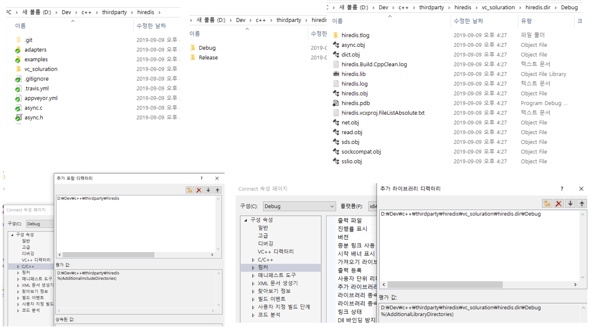

# RedisCpp-hiredis

## 개요
- 원본 소스는 [RedisCppTeam/RedisCpp-hiredis](https://github.com/RedisCppTeam/RedisCpp-hiredis )
- 원본 소스를 조금 수정하여 hiredis와 header-only로 사용 가능하다.
    - hiredis는 C 언어용 redis 클라이언트 라이브러리이고, RedisCpp는 이것을 C++용으로 랩핑한 것이다.
	- src 디렉토리에 1개의 헤더파일로 되어있다.
  
     
          
## 사용하기
### Windows
- hiredis 소스와 lib 디렉토리를 지정한다.
   
- 'CRedisConn.h' 헤더 파일을 추가한다.  
  

## Sample
`CRedisConn_test.cpp` 파일은 원본 소스의 예제이다.    
 
### 연결
- Smaples/Connect
    
### List 사용하기
- Smaples/List